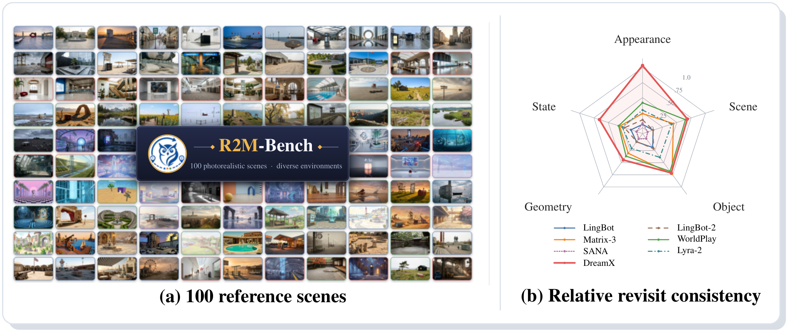
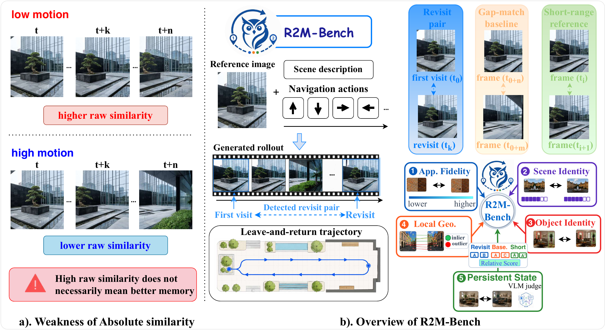

# 🦉 R2M-Bench

**Evaluating Revisit Memory via Relative Consistency in Interactive Video World Models**

[](https://arxiv.org/abs/2608.27328)
[](https://huggingface.co/datasets/GD-ML/R2MBench)

Official implementation of **R2M-Bench (Relative Revisit Memory Benchmark)**, a benchmark for evaluating how consistently interactive video world models recover previously visited scenes.

**100 reference scenes · 3 leave-and-return trajectories · 300 evaluation instances · 5 metric families**

<p align="center">
  
</p>

**R2M-Bench at a glance.** Reference scenes and template-balanced NMR profiles across five evaluation families for seven video world models, as reported in the [paper](https://arxiv.org/abs/2608.27328).

## 📑 Contents

- [🔍 Overview](#overview)
- [📦 Dataset](#dataset)
- [🛠️ Installation](#installation)
- [🚀 Evaluation](#evaluation)
- [📊 Results and scoring](#results-and-scoring)
- [🗂️ Repository layout](#repository-layout)
- [📖 Citation](#citation)

<a name="overview"></a>

## 🔍 Overview

A model can produce similar first-visit and return frames simply by barely changing the scene. R2M-Bench evaluates **revisit-selective consistency** by comparing a revisit with two controls from the same rollout: a gap-matched non-revisit baseline and a short-range pair. **MemoryGain (MG)** measures the revisit advantage over the baseline; the **Normalized Memory Ratio (NMR)** calibrates this advantage using short-horizon consistency.

<p align="center">
  
</p>

**Evaluation pipeline.** Revisit pairs are identified from commanded trajectories and compared with a gap-matched baseline and a short-range reference from the same video.

The evaluation covers **11 metrics across five families**:

| Family | What it measures | Metrics / backends |
|---|---|---|
| `appearance` | Appearance fidelity | PSNR, SSIM, LPIPS |
| `scene_identity` | Scene identity | DINOv2, BoQ, MutualVPR similarity |
| `geometric` | Local geometric consistency | Match ratio and RANSAC inlier ratio with SuperPoint + LightGlue |
| `object` | Object appearance and semantic persistence | GroundingDINO + SAM2 + DINOv2 + CLIP |
| `persistent_state` | Persistent scene state | Structured VLM assessment |

This repository provides generation specifications, reference camera trajectories, pair sampling, metric evaluation, and result aggregation. Generate videos with your own model, then evaluate them with the supplied scripts. The first four metric families run locally on GPU; `persistent_state` uses a VLM API.

<a name="dataset"></a>

## 📦 Dataset

The conditioning images are available on [Hugging Face](https://huggingface.co/datasets/GD-ML/R2MBench). The uploaded folder is **`test_imgs/`**, containing the 100 reference images. Generation prompts and camera trajectories are included in this repository.

### Download

Run the following commands from the repository root:

```bash
python -m pip install -U huggingface_hub
hf download GD-ML/R2MBench \
  --repo-type dataset \
  --include "test_imgs/**" \
  --local-dir .
```

The bundled metadata currently uses image paths such as `./generated_imgs/0001.png`. On a fresh checkout, create a local symlink so these paths resolve to the downloaded `test_imgs/` folder:

```bash
ln -s test_imgs generated_imgs
```

If `generated_imgs` already exists, ensure it contains the benchmark images or points to `test_imgs/` before continuing.

```text
R2MBench/
├── test_imgs/                    # downloaded conditioning images
├── generated_imgs -> test_imgs   # local alias used by the metadata
├── meta_data/                    # prompts and generation specifications
└── trajectories/                 # reference camera trajectories
```

Check that all image and trajectory paths in the metadata are available:

```bash
python - <<'PY'
import json
from pathlib import Path

specs = sorted(Path("meta_data").glob("data_single_*_100.json"))
assert len(specs) == 3, "Run this command from the repository root."
for spec in specs:
    samples = json.loads(spec.read_text())
    assert len(samples) == 100, f"Unexpected sample count: {spec}"
    for sample in samples:
        for key in ("image", "pose_json_path"):
            assert Path(sample[key]).is_file(), f"Missing: {sample[key]}"
print("Dataset is ready: 300 generation specifications checked.")
PY
```

### Benchmark composition

Each trajectory uses the same 100 reference images, giving **300 videos per evaluated model**.

| Trajectory | Generation specifications | Reference poses | Videos |
|---|---|---|---:|
| `DDDAAA` | [data_single_DDDAAA_100.json](meta_data/data_single_DDDAAA_100.json) | [trajectory_DDDAAA_30s.json](trajectories/trajectory_DDDAAA_30s.json) | 100 |
| `WSLRRLL` | [data_single_WSLRRLL_100.json](meta_data/data_single_WSLRRLL_100.json) | [trajectory_WSLRRLL_30s.json](trajectories/trajectory_WSLRRLL_30s.json) | 100 |
| `revisit_loop` | [data_single_revisit_loop_100.json](meta_data/data_single_revisit_loop_100.json) | [trajectory_revisit_loop_30s.json](trajectories/trajectory_revisit_loop_30s.json) | 100 |

<a name="installation"></a>

## 🛠️ Installation

Use a Linux machine with NVIDIA GPUs, a compatible CUDA environment, and Conda. Run all commands below from the repository root.

### 1. Set up the environment

```bash
bash r2mbench setup
conda activate r2mbench
```

The setup script creates the environment, installs dependencies, prepares the local backends, and writes `run_config.local.conf` with the environment paths. Edit this generated configuration for your evaluation. **Rerunning `setup` rewrites it**, so preserve any task or API settings you have already added.

For a custom environment name or package mirror:

```bash
R2MBENCH_ENV_NAME=r2mbench R2MBENCH_PIP_INDEX=https://pypi.org/simple bash r2mbench setup
```

### 2. Prepare model weights

Download the following checkpoints into `checkpoints/`:

```bash
mkdir -p checkpoints
wget -O checkpoints/ViT-B-32.pt https://openaipublic.azureedge.net/clip/models/40d365715913c9da98579312b702a82c18be219cc2a73407c4526f58eba950af/ViT-B-32.pt
wget -O checkpoints/dinov2_12288.pth https://github.com/amaralibey/Bag-of-Queries/releases/download/v1.0/dinov2_12288.pth
wget -O checkpoints/groundingdino_swint_ogc.pth https://github.com/IDEA-Research/GroundingDINO/releases/download/v0.1.0-alpha/groundingdino_swint_ogc.pth
wget -O checkpoints/sam2.1_hiera_large.pt https://dl.fbaipublicfiles.com/segment_anything_2/092824/sam2.1_hiera_large.pt
```

Download the 512-dimensional checkpoint from [MutualVPR](https://github.com/Gucci233/MutualVPR#-model-weights) and save it as `checkpoints/MutualVPR_model_512.pth`.

The scene-identity implementation also requires a local [DINOv2](https://github.com/facebookresearch/dinov2) source checkout and ViT-B/14 weights at the following paths:

```bash
mkdir -p checkpoints/torch_hub/hub/checkpoints
git clone --depth 1 https://github.com/facebookresearch/dinov2.git \
  checkpoints/torch_hub/hub/facebookresearch_dinov2_main
wget -O checkpoints/torch_hub/hub/checkpoints/dinov2_vitb14_pretrain.pth \
  https://dl.fbaipublicfiles.com/dinov2/dinov2_vitb14/dinov2_vitb14_pretrain.pth
```

Existing checkpoints and source caches can be copied or symlinked into these locations. Some backends, including SuperPoint and LightGlue, download additional weights on their first model initialization, so allow network access for the first evaluation run.

### 3. Check the environment

```bash
bash r2mbench doctor
```

`doctor` checks dependencies, configured checkpoint paths, and backend imports, and reports CUDA availability. It does not require generated videos or run a full evaluation.

<a name="evaluation"></a>

## 🚀 Evaluation

### 1. Generate videos with your model

Each metadata file is a JSON list of generation specifications:

```json
{
  "image": "./generated_imgs/0001.png",
  "prompt": "<the scene prompt provided in the metadata>",
  "pose_json_path": "trajectories/trajectory_DDDAAA_30s.json"
}
```

Use `image` as the first-frame conditioning image, `prompt` as the text input, and `pose_json_path` as the camera trajectory. The reference trajectories contain 481 frames over 30 seconds, with per-frame intrinsics `K` and OpenCV camera-to-world extrinsics `extrinsic`.

Run generation from the repository root so the relative image and trajectory paths resolve. Produce one video per specification, with a separate directory for each trajectory:

```text
<your_output_root>/
├── DDDAAA/         # 100 .mp4 videos
├── WSLRRLL/        # 100 .mp4 videos
└── revisit_loop/   # 100 .mp4 videos
```

Use image IDs such as `0001.mp4` as filenames so each video's sample ID can be traced back to its generation input. Keep filenames unique within each trajectory directory, and avoid `gen.mp4` and `output.mp4`, which the GPU evaluator treats specially by using the parent directory as the sample ID.

**Frame alignment:** video frame `i` must correspond to pose frame `i`; the evaluator does not temporally resample the trajectory. Extra tail frames are ignored, and unavailable frame pairs are discarded. If your generator changes the temporal sampling, supply the corresponding poses for its output frames. Prefer the exact trajectory used during generation.

### 2. Configure evaluation tasks

In the `run_config.local.conf` generated during setup, replace the example `TASK=` entries with your video directories. Use the format `TASK=<name>|<video_dir>|<pose_json>`:

```ini
TASK=MyModel_DDDAAA_30s|<your_output_root>/DDDAAA|trajectories/trajectory_DDDAAA_30s.json
TASK=MyModel_WSLRRLL_30s|<your_output_root>/WSLRRLL|trajectories/trajectory_WSLRRLL_30s.json
TASK=MyModel_revisit_loop_30s|<your_output_root>/revisit_loop|trajectories/trajectory_revisit_loop_30s.json
```

Use the same model prefix and retain the `<model>_<trajectory>_30s` naming convention so the summary script can group results by model and trajectory. Each video directory should contain the `.mp4` files directly.

For the `persistent_state` family, also set your VLM gateway credentials in this configuration:

```ini
API_KEY=<your API key>
API_URL=<your gateway base URL, e.g. https://your-gateway/v1>
```

The run scripts use `gemini-3.1-pro-preview` by default. If your gateway rejects `temperature=0`, set the following **shell environment variable** before launching the evaluation:

```bash
export GATEWAY_NO_TEMPERATURE=1
```

`--metrics all` includes the VLM family. To evaluate the four local GPU families without a VLM API, use `--metrics appearance,scene_identity,geometric,object`.

### 3. Run the metrics

For a first run with the four local GPU families on one GPU:

```bash
bash scripts/run_parallel_eval.sh --config run_config.local.conf \
  --metrics appearance,scene_identity,geometric,object \
  --gpus 0 --batch 1 --shard 1 --tasks 'MyModel_DDDAAA_30s'
```

For all five families across all three trajectories, after configuring the VLM API:

```bash
bash scripts/run_parallel_eval.sh --config run_config.local.conf \
  --metrics all --gpus 0,1,2,3,4,5,6,7 \
  --batch 8 --shard 1 --tasks 'MyModel_*'
```

The parallel runner distributes videos across GPUs, shares frame decoding across the local metric families, and runs persistent-state evaluation concurrently. Adjust the GPU list to your machine and increase `--shard` only when GPU memory allows additional processes.

| Parallel flag | Meaning |
|---|---|
| `--metrics` | Comma-separated metric families, or `all` |
| `--gpus` | GPU IDs available to the runner |
| `--batch` | Number of GPUs to use; defaults to the number listed in `--gpus` |
| `--shard` | Worker processes per GPU |
| `--tasks` | Glob filter over task names |
| `--max_eval_pairs` | Maximum pairs per pair type per video for local GPU metrics, within the presampled pool |

Alternatively, use the serial runner to evaluate one family at a time. For a single trajectory on one GPU:

```bash
bash scripts/run_full_eval.sh --config run_config.local.conf \
  --metrics all --gpus 0 --shards 1 --tasks 'MyModel_DDDAAA_30s'
```

The serial runner also supports `--shards` for video sharding. Pair sampling is shared across families; persistent-state evaluation uses its own pair limit.

<a name="results-and-scoring"></a>

## 📊 Results and scoring

### Aggregate the outputs

Run the summary script in the evaluation environment:

```bash
python src/compute_nmr_summary.py \
  --results-dir results/nmr \
  --output results/nmr_30s_summary.md
```

The generated report contains video counts, per-trajectory results, metric-level MemoryGain and NMR, and a template-balanced **Overall NMR**.

| Output | Location |
|---|---|
| Parallel GPU metrics | `results/nmr/unified/<task>/shard_*/results.json` |
| Serial GPU metrics | `results/nmr/<family>/<task>/shard_*/results.json` |
| Persistent-state metrics | `results/nmr/persistent_state/results_gemini_nmr_<task>.json` |
| Aggregated report | `results/nmr_30s_summary.md` |
| Evaluation logs | `logs/` |

### Reading the scores

For a higher-is-better metric, let `R`, `B`, and `S` denote the video-level mean scores for revisit, baseline, and short-range pairs:

```text
MemoryGain = R - B
DynamicRange = S - B
NMR = mean(MemoryGain) / (mean(DynamicRange) + epsilon)
```

The summary script reverses the differences for LPIPS, where lower is better. It excludes video-metric cases with `DynamicRange <= epsilon` (`1e-8` by default), averages valid gains and dynamic ranges within each trajectory before taking their ratio, then averages the per-trajectory NMR values. Overall NMR averages metrics within each family and then averages the available family scores.

Positive MemoryGain indicates a revisit advantage over the same-rollout baseline. NMR is not a probability and is not clipped to `[0, 1]`. For complete benchmark comparisons, evaluate all three trajectories and all five families, and inspect the report's video counts and missing entries: a partial run can also produce an aggregate score.

<a name="repository-layout"></a>

## 🗂️ Repository layout

```text
R2MBench/
├── r2mbench                 # environment setup and diagnostics
├── README.md
├── assets/                  # paper teaser and evaluation overview
├── run_config.example.conf  # configuration reference
├── meta_data/               # 300 generation specifications
├── trajectories/            # three reference camera trajectories
├── scripts/                 # parallel and serial evaluation runners
├── src/                     # pair sampling, evaluation, and aggregation
│   └── metrics/             # five metric families
├── checkpoints/             # downloaded model weights and source caches
└── third_party/             # local metric backends
```

<a name="citation"></a>

## 📖 Citation

If you use R2M-Bench in your research, please cite our [paper](https://arxiv.org/abs/2608.27328):

```bibtex
@article{gu2026r2m,
  title={R2M-Bench: Evaluating Revisit Memory via Relative Consistency in Interactive Video World Models},
  author={Gu, Qiwen and Gao, Bingjie and Chen, Rui and Li, Geng and Li, Jifan and Wen, Qishuai and Niu, Li and Tang, Jing and Chu, Xiangxiang and Zhao, Junqiao},
  journal={arXiv preprint arXiv:2608.27328},
  year={2026}
}
```
